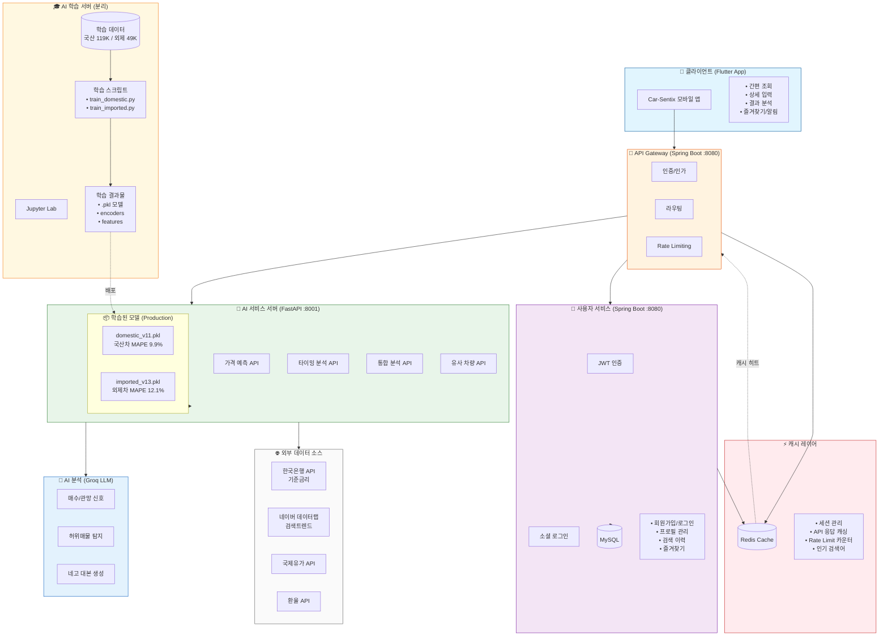
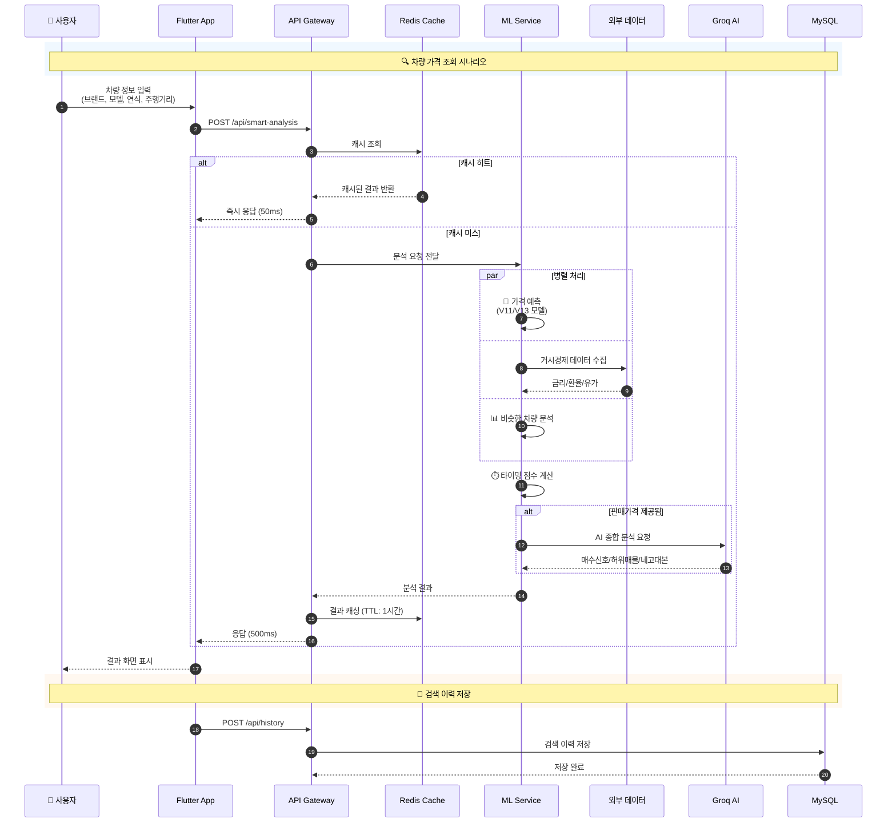
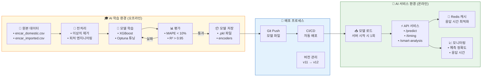
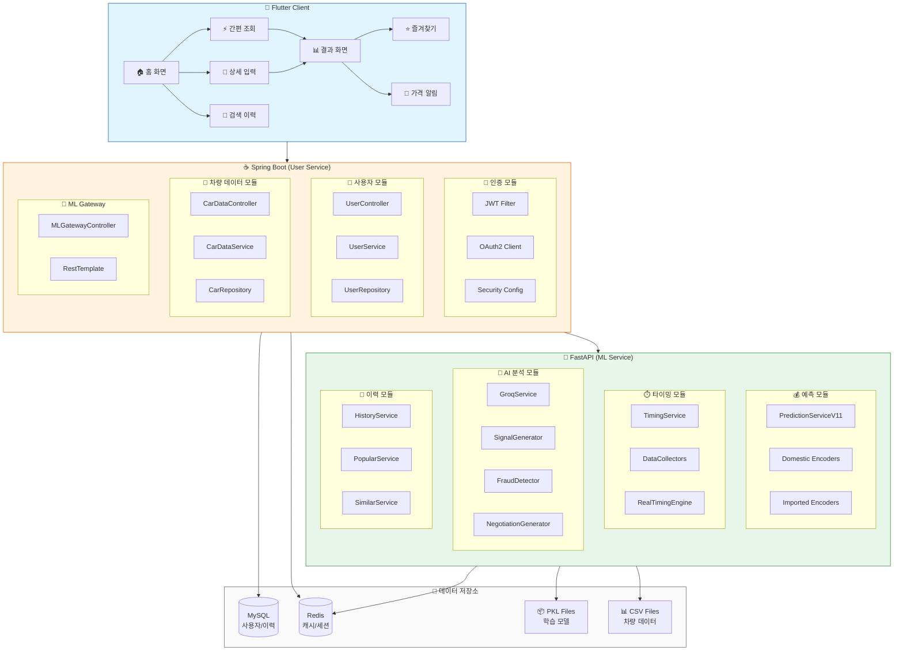
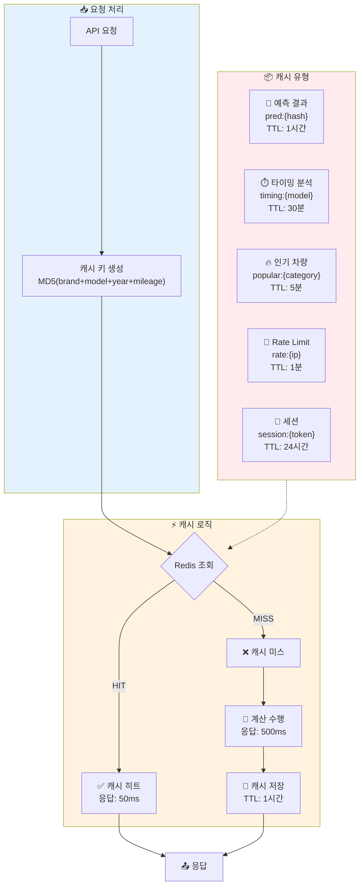
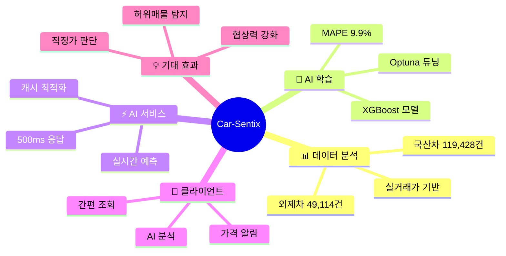
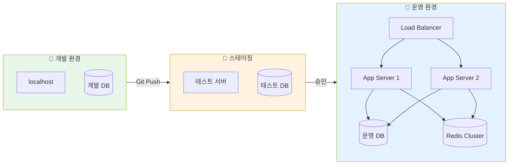

# 🚗 Car-Sentix 서비스 구성도

## 1. 전체 시스템 아키텍처

---

## 2. 데이터 흐름도 (서비스 시나리오)

---

## 3. AI 학습 vs AI 서비스 분리 구조

---

## 4. 상세 컴포넌트 구성도

---

## 5. Redis 캐싱 전략

---

## 6. 서비스 효과 요약

---

## 7. 기술 스택 정리

| 레이어 | 기술 | 용도 |
|--------|------|------|
| **Client** | Flutter, Dart | 크로스플랫폼 모바일 앱 |
| **Gateway** | Spring Boot, Java 17 | API Gateway, 인증 |
| **ML Service** | FastAPI, Python 3.11 | 가격 예측, AI 분석 |
| **AI Model** | XGBoost, Scikit-learn | 머신러닝 모델 |
| **LLM** | Groq (Llama 3.1) | 자연어 분석 |
| **Cache** | Redis 7.x | 캐싱, 세션, Rate Limit |
| **Database** | MySQL 8.x | 사용자, 이력 저장 |
| **External API** | 한국은행, 네이버 | 거시경제 데이터 |

---

## 8. 배포 환경

